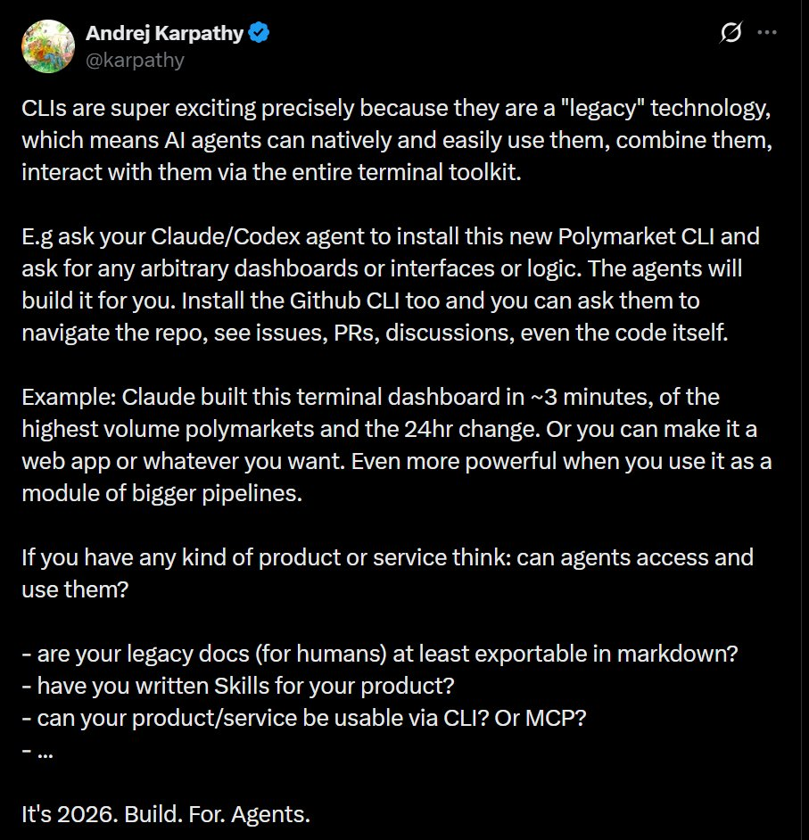

# Agent-Readiness Scorecard

> *"It's 2026. Build. For. Agents."* — Andrej Karpathy



---

## What is this?

Karpathy's tweet asks a simple question: **can AI agents actually use your product?**

So I created this repo as a direct response — a `SKILL.md` file that teaches any AI agent (Claude, Codex, Cursor, etc.) how to systematically audit a product or GitHub repo for agent-readiness and produce a scored report.

Please appreciate the irony: *a Skill that scores whether you have Skills.*

---

## How it works

The scorecard evaluates a product across **6 dimensions**, each targeting a real friction point agents face when trying to use a tool autonomously:

| Dimension | Max | What it measures |
|-----------|-----|-----------------|
| Documentation Accessibility | 20 | Can an agent read and reason over your docs? |
| CLI Availability | 20 | Can an agent operate your product from a terminal? |
| API / MCP Access | 20 | Is there a structured, auth-friendly programmatic interface? |
| Agent Skills / Prompts | 15 | Have you written instructions *for* agents? |
| Discoverability | 15 | Can an agent find and understand your product without hand-holding? |
| Output Parsability | 10 | Are responses — including errors — structured and machine-readable? |
| **Total** | **100** | |

**Ratings:**

| Score | Label |
|-------|-------|
| 90–100 | ✦✦✦✦✦ Agent-Native |
| 70–89 | ✦✦✦✦ Agent-Ready |
| 50–69 | ✦✦✦ Agent-Friendly |
| 30–49 | ✦✦ Agent-Awkward |
| 0–29 | ✦ Agent-Hostile |

---

## Usage

Give an AI agent the `SKILL.md` file and a target — a company name, product URL, or GitHub repo — and ask it to run the scorecard.

**Example prompt:**
```
Using the SKILL.md in this repo, score Stripe for agent-readiness.
Gather evidence, fill out the scorecard, and give me the top 3 recommendations.
```

The agent will check for CLIs, MCP servers, auth patterns, SDK availability, error handling quality, `/llms.txt`, and more — then produce a full scored report with an evidence summary and actionable recommendations.

---

## Example output

```
AGENT-READINESS SCORECARD
=========================
Target: Stripe
Evaluated: 2026-02-24

Documentation Accessibility:  18 / 20
CLI Availability:              19 / 20
API / MCP Access:              18 / 20
Agent Skills / Prompts:         5 / 15
Discoverability:               10 / 15
Output Parsability:             9 / 10
                               --------
TOTAL:                         79 / 100  ✦✦✦✦ Agent-Ready

TOP 3 RECOMMENDATIONS
---------------------
1. Publish a SKILL.md — agents have to figure out the API by trial and error (+8 pts)
2. Register the MCP server in public registries like mcp.so (+5 pts)
3. Add agent-oriented use-case examples to the README (+4 pts)
```

---

## Why this matters

Most products are built for human users. But increasingly the entity *using* your product is an AI agent acting on behalf of a human — in a pipeline, in a terminal, in the middle of the night with no one watching.

If your product requires a browser popup to authenticate, returns HTML error pages on failure, or has docs only in PDF format, agents can't use it. Your product is effectively invisible to the agentic layer.

The companies that get this early will have a compounding advantage — agents will prefer, recommend, and repeatedly reach for tools they can actually interact with programmatically.

---

## Files

```
agent-readiness-scorecard/
├── README.md          ← you are here
├── SKILL.md           ← the scorecard skill file for AI agents
└── karpathy-tweet.png ← the tweet that inspired this
```

---

## Author

**Pranay Tiwari** — VP Data Science | [LinkedIn](https://www.linkedin.com/in/pranay-tiwari)

*Built in response to [@karpathy](https://twitter.com/karpathy)'s call to build for agents.*
